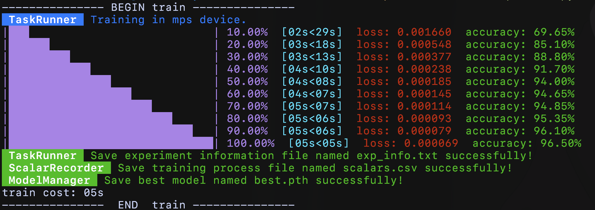

## Introduction

This is an individual module, which is mainly for pytorch training.

Moreover, it also supports some extra features: saving model, saving training process, plotting figures and so on...

## Install

`pip install Fau-tools`

## Usage

### import

The following code is recommended.

```python
import Fau_tools  
from Fau_tools import torch_tools
```

### quick start

I will use a simple example to help you get started quickly!

**The following example uses Fau-tools to train a model for MNIST hand-written digits.**

```python
import torch  
import torch.utils.data as tdata  
import torchvision  
from torch import nn  
  
import Fau_tools  
from Fau_tools import torch_tools

# A simple CNN network
class CNN(nn.Module):  
   def __init__(self):  
      super().__init__()  
      self.conv = nn.Sequential(  
         nn.Conv2d(1, 16, 3, 1, 1),  # -> (16, 28, 28)  
         nn.ReLU(),  
         nn.MaxPool2d(2),  # -> (16, 14, 14)  
  
         nn.Conv2d(16, 32, 3, 1, 1),  # -> (32, 14, 14)  
         nn.ReLU(),  
         nn.MaxPool2d(2)  # -> (32, 7, 7)  
      )  
      self.output = nn.Linear(32 * 7 * 7, 10)  
  
   def forward(self, x):  
      x = self.conv(x)  
      x = x.flatten(1)  # same as x = x.view(x.size(0), -1)  
      return self.output(x)
```

```python
# Hyper Parameters definition  
EPOCH = 5  
LR = 1E-3  
BATCH_SIZE = 2048

# Load dataset
TRAIN_DATA = torchvision.datasets.MNIST('Datasets', True, torchvision.transforms.ToTensor(), download=True)  
TEST_DATA = torchvision.datasets.MNIST('Datasets', False, torchvision.transforms.ToTensor())

# Get data loader
train_loader = tdata.DataLoader(TRAIN_DATA, BATCH_SIZE, True)  
test_loader = tdata.DataLoader(TEST_DATA, BATCH_SIZE)

# Initialize model, optimizer and loss function
model = CNN()  
optimizer = torch.optim.Adam(model.parameters(), LR)  
loss_function = nn.CrossEntropyLoss()

# Train!
torch_tools.torch_train(model, train_loader, test_loader, optimizer, loss_function, EPOCH, "MNIST")  
# the last parameter is the name for saving model and training process.
```

Now, we can run our python file, and the training process will be visualized, just like the following picture.



Two files named `MNIST_9461.pth` and `MNIST_9461.csv` will be saved.
The first file is the trained model and the second file holds the training process, which you can use matplotlib to visualize it.

The above is the primary usage of this tool, but there are also some other nifty features, which will be introduced later. 

## ENDING

Hope you will like it! And welcome issues and pull requests.
